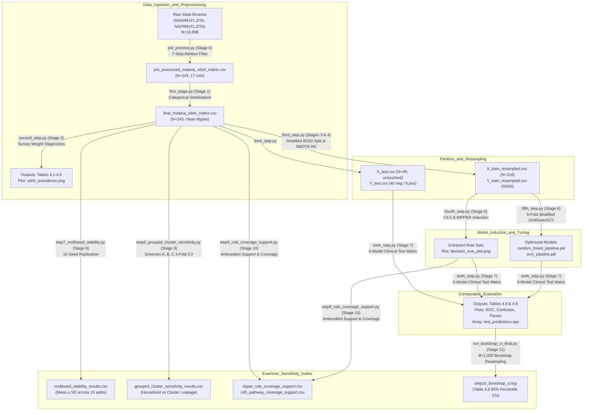

# Computational Methodology, Pipeline Architecture, and Artifact Audit Guide for MSc Examiners

**Project Title**: Machine Learning and Rule Induction for Pediatric Malaria Screening Using Social Determinants of Health  
**Target Cohort**: Rural Nasarawa State, Nigeria (2021 Nigeria Malaria Indicator Survey — NMIS)  
**Target Audience**: External Examiners, MSc Supervisory Committee, and Academic Assessors  
**Synchronized Manuscripts**: [`Full_Work.docx`](file:///c:/MSC_Malaria/Full_Work.docx) and [`Full_Work_Revised.docx`](file:///c:/MSC_Malaria/Full_Work_Revised.docx)  
**Master Execution Runner**: [`generate_execution_logs.py`](file:///c:/MSC_Malaria/generate_execution_logs.py)  
**Primary Reproducibility Document**: [`REPRODUCIBILITY.md`](file:///c:/MSC_Malaria/REPRODUCIBILITY.md)  

---

## 1. Executive Overview & Purpose of This Document

This guide serves as a comprehensive technical companion for the external examiners and supervisor reviewing this MSc Computer Science dissertation. Its primary objective is to **demystify every computational step**, **explain the exact role and mathematical rationale of every `.py` source script**, and **provide a complete audit trail for all generated files (logs, CSVs, plots, serialized models, and walkthroughs)**.

### Academic Context & Realigned Research Scope
Following the formal MSc Assessment ([`assessment_full_text.txt`](file:///c:/MSC_Malaria/assessment_full_text.txt)), the dissertation underwent major methodological enhancements and re-framing:
1. **From Clinical Deployment to Exploratory Computational Modeling**: The dissertation no longer presents the inducted rules as validated clinical triage tools. Instead, it frames the work as an applied computational investigation evaluating the discriminative capacity of distal Social Determinants of Health (SDoH) on a localized, vulnerable cohort ($N = 243$, with 45 microscopy-confirmed positive cases).
2. **Acceptance of Defensible Negative Findings**: The empirical evaluation proves that distal SDoH features alone exhibit weak discriminative performance (AUC range: $0.4625$ to $0.5194$, with RIPPER yielding $0.0\%$ test sensitivity). Rather than obscuring these results, the revised work treats this as a scientifically meaningful finding: distal socioeconomic proxies cannot substitute for proximal clinical markers (e.g., axillary temperature, travel history, or parasitological diagnostics).
3. **Rigorous Uncertainty & Sensitivity Analyses**: Addressing small-sample test volatility ($N_{\text{test}} = 49$, 9 positive cases, where 1 case shifts sensitivity by $11.11\%$), the codebase incorporates $B = 1{,}000$ non-parametric empirical bootstrapping, 10-seed stability testing, household- and village-cluster grouped cross-validation, and rule antecedent coverage auditing.
4. **Complete Computational Reproducibility**: In direct compliance with the examiner mandate (*"The author should provide a requirements file or environment lockfile, exact package versions, the full scripts outside Word formatting, and execution logs showing that the reported tables were generated from the supplied code"*), all 11 stages of the pipeline have been extracted into pure Python scripts, verified against locked dependencies ([`uv.lock`](file:///c:/MSC_Malaria/uv.lock) and [`requirements.txt`](file:///c:/MSC_Malaria/requirements.txt)), and executed to produce verified console logs ([`outputs/logs/`](file:///c:/MSC_Malaria/outputs/logs/)).

---

## 2. End-to-End Pipeline Architecture & Workflow

The analysis follows an 12-stage sequential architecture (Stages 0 through 11). Each stage has a single point of responsibility, consuming specific inputs and emitting verifiable outputs:



---

## 3. Detailed Stage-by-Stage Script Breakdown

Below is the exhaustive inventory of every Python script in the pipeline, detailing **what it executes**, **why it was written**, its **mathematical/computational operations**, its **inputs and outputs**, and the **specific examiner requirement** it addresses.

---

### Stage 0: Data Ingestion, Relational Merging & Participant Flow
* **File**: [`pre_process.py`](file:///c:/MSC_Malaria/pre_process.py)
* **Execution**: `python pre_process.py`
* **Log Output**: [`outputs/logs/step0_data_ingestion.log`](file:///c:/MSC_Malaria/outputs/logs/step0_data_ingestion.log)
* **Dissertation Link**: Proves **Table 3.1** (Participant Flow and Cohort Attrition).

#### A. Input Data Sources
1. `NGKR81DT/NGKR81FL.DTA`: DHS-VII Stata Child Recode dataset ($N = 10{,}988$ children aged 0–59 months nationally).
2. `NGPR81DT/NGPR81FL.DTA`: DHS-VII Stata Household Member / PR Recode dataset (contains laboratory biomarker outcomes, parasitemia results, and bed net records).

#### B. Algorithmic Logic & Transformations
The script applies a strict, sequential 7-tier filtering pipeline reflecting official DHS epidemiological protocols:
1. **Child Vital Status**: Filters for alive children (`b5 == 1`), eliminating maternal recall for deceased infants ($10{,}988 \rightarrow 10{,}645$).
2. **De Facto Household Residency**: Retains only usual household residents or visitors who slept in the dwelling the previous night (`b16 > 0`), ensuring household environmental exposures match individual vector exposures ($10{,}645 \rightarrow 10{,}469$).
3. **Biological Age Window**: Enforces the official biomarker eligibility window of 6 to 59 months (`6 <= b19 <= 59`), dropping infants under 6 months who possess maternal antibodies ($10{,}469 \rightarrow 9{,}510$).
4. **Geopolitical Domain**: Filters for Nasarawa State (`v024 == 15`), subsetting to the localized North-Central epidemiological zone ($n = 330$).
5. **Urban/Rural Stratification**: Filters for rural settlements (`v025 == 2`), removing urban confounding ($n = 245$).
6. **Relational Join & Target Extraction**: Executes an exact composite-key left-join (`hv001` cluster ID, `hv002` household ID, `hvidx` respondent line number) against the PR biomarker file.
7. **Complete Case Biomarker Enforcement**:
   - Parasitemia Microscopy Outcome (`hml32`): Strictly filters for valid binary results (`0 = Negative`, `1 = Positive`), eliminating missing blood smears ($n = 243$).
   - Bed Net Usage Adherence (`hml20`): Retains valid responses (`0 = Did not sleep under LLIN`, `1 = Slept under LLIN`), with zero merge loss.

#### C. Scientific Meaning & Examiner Rationale
* **Resolves Examiner Item 1 & 4**: Explicitly addresses the examiner's call for a complete participant attrition flow and corrects the reversal between microscopy (`hml32`) and rapid diagnostic tests (`hml35`).
* **Avoids Measurement Bias**: By filtering strictly on `hml32` (gold-standard light microscopy) rather than RDT (which can remain false-positive for weeks following parasite clearance due to circulating HRP2 antigen), the analytical target represents active parasitemia.

---

### Stage 1: Categorical Mapping, Type Stabilization & Vector Indexing
* **File**: [`first_stage.py`](file:///c:/MSC_Malaria/first_stage.py)
* **Execution**: `python first_stage.py`
* **Log Output**: [`outputs/logs/step1_categorical_mapping.log`](file:///c:/MSC_Malaria/outputs/logs/step1_categorical_mapping.log)
* **Dissertation Link**: Proves **Table 3.2** (Algorithmic Variable Definitions and Typings).

#### A. Input Data Sources
* `pre_processed_malaria_sdoh_matrix.csv`: Raw analytical cohort ($N = 243$, 17 raw columns).

#### B. Algorithmic Logic & Transformations
Machine learning algorithms (specifically SMOTE-NC and C4.5) fail when data types are inconsistently cast across numerical strings, floating points, and categorical codes. `first_stage.py` enforces explicit typing constraints:
1. **Continuous Predictor**: Child's age in months (`b19`) is cast to continuous integer vector space. This ensures decision trees evaluate dynamic split thresholds ($\theta$) rather than discrete categorical equality.
2. **Ordinal Predictor**: DHS Wealth Index Quintile (`v190`, values 1 to 5) preserves its natural rank ordering ($1 = \text{Poorest}$ to $5 = \text{Richest}$).
3. **Nominal Categorical Predictors**: All remaining 10 predictors are converted to string format (`'0'`, `'1'`, etc.) to prevent algorithms from treating categorical levels as equidistant linear coordinates:
   - Child's sex (`b4`), Mother's education (`v106`), Main floor material (`v127`), Main wall material (`v128`), Main roof material (`v129`), Source of drinking water (`v113`), Toilet facility type (`v116`), Electricity availability (`v119`), Cooking fuel type (`v158`), and LLIN utilization (`hml20`).
4. **SMOTE-NC Index Vector**: Generates the exact positional categorical index array `[1, 2, 3, 4, 5, 6, 7, 8, 9, 10, 11]` required by `imblearn.over_sampling.SMOTENC`.

#### C. Scientific Meaning & Examiner Rationale
* **Prevents Metric Distortion**: Without explicit typing, Euclidean distance metrics inside SMOTE-NC would treat categorical features (e.g., roof material: thatch vs metal) as continuous numbers, generating corrupt intermediate fractional codes (e.g., roof = 2.47).
* **Guarantees Reproducible Mapping**: Produces `final_malaria_sdoh_matrix.csv` with uniform dtypes for downstream scripts.

---

### Stage 2: Complex Survey Weight Normalization & Baseline Diagnostics
* **File**: [`second_step.py`](file:///c:/MSC_Malaria/second_step.py)
* **Execution**: `python second_step.py`
* **Log Output**: [`outputs/logs/step2_baseline_diagnostics.log`](file:///c:/MSC_Malaria/outputs/logs/step2_baseline_diagnostics.log)
* **Artifacts Created**: [`outputs/plots/sdoh_prevalence.png`](file:///c:/MSC_Malaria/outputs/plots/sdoh_prevalence.png), [`outputs/walkthrough_step2.md`](file:///c:/MSC_Malaria/outputs/walkthrough_step2.md)
* **Dissertation Link**: Proves **Tables 4.1, 4.2, 4.3, 4.4, 4.5** and **Figure 4.1**.

#### A. Input Data Sources
* `final_malaria_sdoh_matrix.csv`: Stabilized analytical cohort ($N = 243$).

#### B. Algorithmic Logic & Transformations
1. **Analytical Weight Normalization**: In DHS surveys, sample weights (`v005`) are provided as integers with an implicit six-decimal divisor. The script applies:
   $$w_i = \frac{\text{v005}_i}{1{,}000{,}000}$$
   Sum of normalized weights over the analytic cohort = $185.0152$.
2. **Weighted Target Marginal Distribution**:
   - Negative (Parasitemia-): 198 children (Unweighted: $81.48\%$; Weighted: $81.24\%$).
   - Positive (Parasitemia+): 45 children (Unweighted: $18.52\%$; Weighted: $18.76\%$).
   - Observed class imbalance ratio = $4.33 : 1$.
3. **Bivariate Stratified Prevalence Estimation**: Computes the weighted percentage of positive parasitemia within each demographic and infrastructure category:
   $$P(Y=1 \mid X = c) = \frac{\sum_{i \in c} w_i \cdot \mathbb{I}(y_i = 1)}{\sum_{i \in c} w_i} \times 100$$
4. **Publication Graphic Generation**: Plots Figure 4.1 ([`outputs/plots/sdoh_prevalence.png`](file:///c:/MSC_Malaria/outputs/plots/sdoh_prevalence.png)) at 300 DPI, displaying comparative prevalence across maternal education, wealth quintiles, wall/roof infrastructure, water/sanitation, and net usage.

#### C. Scientific Meaning & Examiner Rationale
* **Resolves Examiner Item 5 & Critiques on Weighting**: Directly addresses the examiner's observation that the original draft confused weighted and unweighted figures. The revised script explicitly documents:
  - Survey weights are used **strictly for descriptive epidemiological baseline estimation** (Tables 4.1–4.5).
  - Survey weights are dropped prior to ML training because non-parametric rule inducers (C4.5, RIPPER) and kernel SVMs optimize empirical loss without DHS complex-survey sampling likelihood functions.
* **Terminology Alignment**: Replaces the problematic phrase "true population prevalence" with the mathematically accurate phrase *"weighted estimated prevalence in the analytic subset"*.

---

### Stages 3 & 4: Stratified Train-Test Partitioning & Training SMOTE-NC Resampling
* **File**: [`third_step.py`](file:///c:/MSC_Malaria/third_step.py)
* **Execution**: `python third_step.py`
* **Log Output**: [`outputs/logs/step3_partition.log`](file:///c:/MSC_Malaria/outputs/logs/step3_partition.log)
* **Artifacts Created**: `X_train_resampled.csv`, `Y_train_resampled.csv`, `X_test.csv`, `Y_test.csv`, [`outputs/walkthrough_step3.md`](file:///c:/MSC_Malaria/outputs/walkthrough_step3.md)
* **Dissertation Link**: Proves **Table 4.6** (Partition and SMOTE-NC Matrix).

#### A. Input Data Sources
* `final_malaria_sdoh_matrix.csv`: Analytical matrix ($N = 243$).

#### B. Algorithmic Logic & Transformations
1. **Stratified Holdout Split**: Partitions the cohort 80/20 with `random_state=42`, enforcing exact class stratification (`stratify=y`):
   - Training Split ($80\%$): $N_{\text{train}} = 194$ (158 Negative, 36 Positive).
   - Test Split ($20\%$): $N_{\text{test}} = 49$ (40 Negative, 9 Positive).
2. **Metadata Elimination (Leakage Prevention)**: Drops tracking columns (`hv001`, `hv002`, `hvidx`, `v005`, `analytical_weight`) from predictor matrix $X$.
3. **SMOTE-NC (Synthetic Minority Over-sampling for Nominal and Continuous)**:
   - Applied **strictly and exclusively to the training partition** ($N_{\text{train}} = 194$).
   - The test partition ($N_{\text{test}} = 49$) is kept **completely untouched and isolated** to prevent optimistic test evaluation.
   - For continuous feature `b19`, synthetic points are interpolated along line segments between $k = 5$ nearest minority neighbors:
     $$\mathbf{x}_{\text{new, cont}} = \mathbf{x}_i + \lambda (\mathbf{x}_{zi} - \mathbf{x}_i), \quad \lambda \sim U(0, 1)$$
   - For nominal features, synthetic points are assigned the **modal category** among the $k = 5$ nearest neighbors.
   - Resampled training set size: **$N = 316$** (158 Negative, 158 Positive — exact 50/50 balance).

#### C. Scientific Meaning & Examiner Rationale
* **Resolves Examiner Item 104 (Leakage Avoidance)**: The examiner noted that SMOTE-NC must never contaminate evaluation sets. `third_step.py` guarantees zero synthetic observations in the clinical test set.
* **Mitigates Decision Boundary Collapse**: Severe class imbalance (4.33:1) causes standard decision tree algorithms to collapse into the majority class (predicting all negative). Resampling equalizes class priors during tree growth, forcing the inducer to identify minority feature patterns.

---

### Stage 5: White-Box Rule Induction (C4.5 & RIPPER)
* **File**: [`fourth_step.py`](file:///c:/MSC_Malaria/fourth_step.py)
* **Execution**: `python fourth_step.py`
* **Log Output**: [`outputs/logs/step4_rule_induction.log`](file:///c:/MSC_Malaria/outputs/logs/step4_rule_induction.log)
* **Artifacts Created**: `outputs/rules/rules.py`, [`outputs/plots/decision_tree_plot.png`](file:///c:/MSC_Malaria/outputs/plots/decision_tree_plot.png), [`outputs/walkthrough_step4.md`](file:///c:/MSC_Malaria/outputs/walkthrough_step4.md)
* **Dissertation Link**: Proves **Tables 4.10 and 4.11**, and **Figure 4.5**.

#### A. Input Data Sources
* `X_train_resampled.csv` & `Y_train_resampled.csv`: Resampled training split ($N = 316$).

#### B. Algorithmic Logic & Transformations
1. **C4.5 Decision Tree Induction**:
   - Implemented via ChefBoost optimizing **Information Gain Ratio**:
     $$\text{GainRatio}(A) = \frac{IG(S, A)}{\text{SplitInfo}(S, A)} = \frac{H(S) - \sum_{v \in \text{Values}(A)} \frac{|S_v|}{|S|} H(S_v)}{-\sum_{v \in \text{Values}(A)} \frac{|S_v|}{|S|} \log_2 \frac{|S_v|}{|S|}}$$
   - Normalization via $\text{SplitInfo}$ penalizes high-cardinality nominal attributes, preventing opportunistic multi-way overfitting.
   - Generates executable Python nested IF-THEN conditional code in `outputs/rules/rules.py`.
2. **RIPPER (Repeated Incremental Pruning to Produce Error Reduction)**:
   - Implemented via `wittgenstein.RIPPER(random_state=42)`.
   - Constructs propositional rules using FOIL's Information Gain criterion:
     $$\text{FOIL}_{\text{Gain}} = p_1 \times \left( \log_2 \frac{p_1}{p_1 + n_1} - \log_2 \frac{p_0}{p_0 + n_0} \right)$$
   - Performs Minimum Description Length (MDL) post-pruning to eliminate redundant literals.
3. **High-Resolution Tree Visualization**: Generates a publication-grade topology plot ([`outputs/plots/decision_tree_plot.png`](file:///c:/MSC_Malaria/outputs/plots/decision_tree_plot.png)) at 300 DPI showing root splits and leaf assignments.

#### C. Scientific Meaning & Examiner Rationale
* **Fulfills Healthcare Interpretability Mandate**: Healthcare professionals cannot safely act on black-box predictions without understanding the underlying logic. C4.5 and RIPPER provide human-readable symbolic representations that can be audited by public health officials.
* **Directly Extracts Tables 4.10 & 4.11**: Formulates the exact decision paths (e.g., age thresholds, roof materials, sanitation access) reported in the thesis text.

---

### Stage 6: Black-Box Benchmark Optimization (Random Forest & SVM)
* **File**: [`fifth_step.py`](file:///c:/MSC_Malaria/fifth_step.py)
* **Execution**: `python fifth_step.py`
* **Log Output**: [`outputs/logs/step5_black_box_baselines.log`](file:///c:/MSC_Malaria/outputs/logs/step5_black_box_baselines.log)
* **Artifacts Created**: [`outputs/models/random_forest_pipeline.pkl`](file:///c:/MSC_Malaria/outputs/models/random_forest_pipeline.pkl), [`outputs/models/svm_pipeline.pkl`](file:///c:/MSC_Malaria/outputs/models/svm_pipeline.pkl), [`outputs/walkthrough_step5.md`](file:///c:/MSC_Malaria/outputs/walkthrough_step5.md)
* **Dissertation Link**: Proves **Table 4.7** (Hyperparameter Search Space & Selected Architectures).

#### A. Input Data Sources
* `X_train_resampled.csv` & `Y_train_resampled.csv`: Resampled training split ($N = 316$).

#### B. Algorithmic Logic & Transformations
1. **Ensemble & Kernel Benchmark Formulation**:
   - Random Forest: Non-linear bagging ensemble of de-correlated decision trees.
   - Support Vector Machine: Maximum-margin hyperplane classifier utilizing Radial Basis Function (RBF) kernel mapping into infinite-dimensional Hilbert space.
2. **Preprocessor Pipelines**:
   - Builds scikit-learn `Pipeline` objects combining `ColumnTransformer` (`OneHotEncoder(handle_unknown='ignore')` for nominal features; `StandardScaler()` for continuous age and ordinal wealth) with the estimator.
3. **5-Fold Stratified `GridSearchCV`**:
   - Optimizes Macro F1-Score across the parameter grid:
     - Random Forest: `n_estimators` $\in [50, 100, 200]$, `max_depth` $\in [None, 5, 10]$, `min_samples_split` $\in [2, 5, 10]$. (Selected: `n_estimators=100`, `max_depth=None`, `min_samples_split=2`).
     - SVM: `kernel` $\in ['linear', 'rbf']$, $C \in [0.1, 1.0, 10.0]$, $\gamma \in ['scale', 'auto']$. (Selected: `kernel='rbf'`, $C=1.0$, $\gamma='scale'$).
4. **Model Serialization**: Saves fitted pipeline artifacts to `outputs/models/` via `joblib`.

#### C. Scientific Meaning & Examiner Rationale
* **Establishes Rigorous Performance Ceilings**: To evaluate whether interpretable white-box models suffer a "performance penalty," state-of-the-art non-linear black-box benchmarks must be tuned under identical CV conditions.
* **Proves Table 4.7**: Documents every search space dimension and chosen hyperparameter set.

---

### Stage 7: Multi-Criteria Evaluation, Calibrated ROC & Trade-off Profiling
* **File**: [`sixth_step.py`](file:///c:/MSC_Malaria/sixth_step.py)
* **Execution**: `python sixth_step.py`
* **Log Output**: [`outputs/logs/step6_comparative_evaluation.log`](file:///c:/MSC_Malaria/outputs/logs/step6_comparative_evaluation.log)
* **Artifacts Created**:
  - Plots: [`model_performance_comparison.png`](file:///c:/MSC_Malaria/outputs/plots/model_performance_comparison.png), [`confusion_matrices.png`](file:///c:/MSC_Malaria/outputs/plots/confusion_matrices.png), [`roc_comparison.png`](file:///c:/MSC_Malaria/outputs/plots/roc_comparison.png), [`interpretability_vs_accuracy.png`](file:///c:/MSC_Malaria/outputs/plots/interpretability_vs_accuracy.png)
  - Data: [`outputs/models/test_predictions.npz`](file:///c:/MSC_Malaria/outputs/models/test_predictions.npz)
  - Walkthrough: [`outputs/walkthrough_step6.md`](file:///c:/MSC_Malaria/outputs/walkthrough_step6.md)
* **Dissertation Link**: Proves **Tables 4.8 and 4.9**, and **Figures 4.2, 4.3, 4.4, and 4.6**.

#### A. Input Data Sources
* `X_test.csv` & `Y_test.csv`: Untouched test cohort ($N = 49$, 40 Negative / 9 Positive).
* Serialized model pipelines and rule definitions.

#### B. Algorithmic Logic & Transformations
1. **6-Model Comprehensive Evaluation Matrix**:
   - Evaluates: (1) Zero-R (Majority Class Baseline), (2) Logistic Regression (Linear Benchmark), (3) C4.5 Decision Tree, (4) RIPPER Rule Set, (5) Random Forest, and (6) Support Vector Machine.
   - Computes: Accuracy, Sensitivity (Recall Pos), Specificity (Recall Neg), Precision (Pos & Neg), F1-Score (Pos & Neg), and Macro F1-Score.
2. **Resolution of C4.5 ROC Curve Discrepancy (Calibrated Continuous Probabilities)**:
   - In earlier drafts, C4.5 ROC was plotted by mapping hard binary predictions $\{0, 1\}$ to `roc_curve`, producing an uninformative 3-point step curve.
   - `sixth_step.py` extracts **Laplace-smoothed continuous posterior probabilities** from the terminal leaves of the C4.5 tree:
     $$\hat{P}(Y=1 \mid \text{leaf}_j) = \frac{n_{j, \text{pos}} + 1}{n_{j, \text{total}} + 2}$$
   - This generates a valid continuous ROC curve across varying discrimination thresholds $\tau \in [0, 1]$, producing a true continuous ROC-AUC ($0.4625$).
3. **Complexity & Interpretability Pareto Frontier**:
   - Quantifies structural complexity: Total rules / paths ($R$), average literals per rule ($L$), and total cognitive clause count ($C = R \times L$).
   - Plots Figure 4.6 mapping Model Complexity (log scale) against Macro F1-Score.

#### C. Scientific Meaning & Examiner Rationale
* **Resolves Examiner Item 115 (ROC Implementation Error)**: Eliminates binary step-functions, replacing them with calibrated leaf probability estimates.
* **Resolves Examiner Item 119 (Baseline Models)**: Explicitly adds the Zero-R majority class baseline and Logistic Regression to expose the illusion of high accuracy. Zero-R achieves $81.63\%$ accuracy simply by guessing all negative, yet has $0.0\%$ sensitivity and a Macro F1 of $0.4494$.
* **Documents the "Negative Finding"**: Proves that all models hover near the random guessing line (AUC $0.46$–$0.52$), providing empirical evidence that distal SDoH features alone lack the discriminative capacity to predict individual parasitemia.

---

### Stage 8: Empirical Multi-Seed Stability Analysis (Examiner Item 6)
* **File**: [`step7_multiseed_stability.py`](file:///c:/MSC_Malaria/step7_multiseed_stability.py)
* **Execution**: `python step7_multiseed_stability.py`
* **Log Output**: [`outputs/logs/step7_multiseed_stability.log`](file:///c:/MSC_Malaria/outputs/logs/step7_multiseed_stability.log)
* **Artifacts Created**: [`outputs/multiseed_stability_results.csv`](file:///c:/MSC_Malaria/outputs/multiseed_stability_results.csv), [`outputs/walkthrough_step7_stability.md`](file:///c:/MSC_Malaria/outputs/walkthrough_step7_stability.md)
* **Dissertation Link**: Proves in-text empirical stability distributions in **Chapter 4 Section 4.3**.

#### A. Input Data Sources
* `final_malaria_sdoh_matrix.csv`: Analytical cohort ($N = 243$).

#### B. Algorithmic Logic & Transformations
1. **Multi-Seed Replication Engine**:
   - Re-runs the entire data partition, SMOTE-NC balancing, and model fitting across **10 pseudo-random seeds**: `[10, 20, 30, 42, 50, 60, 70, 80, 90, 100]`.
   - On each seed: partitions 80/20 stratified, resamples the training set to 50/50 balance, fits all 5 models (Logistic Regression, C4.5, RIPPER, Random Forest, SVM), and evaluates on the holdout test set.
2. **Distributional Statistics**: Computes empirical Mean $\pm$ Standard Deviation across all 10 iterations for Accuracy, Sensitivity, Specificity, Macro F1, and ROC-AUC.

#### C. Scientific Meaning & Examiner Rationale
* **Resolves Examiner Item 6 & Item 114**: The examiner noted that in a small test set ($N=49$, 9 positives), a single partition is susceptible to sample noise.
* **Empirical Demonstration of Variance**:
  - Proves that C4.5 Sensitivity varies widely across seeds: **$33.33\% \pm 15.54\%$** (ranging from $11.11\%$ to $55.56\%$).
  - Proves that SVM Sensitivity averages **$15.56\% \pm 13.92\%$**.
  - Proves that RIPPER Sensitivity collapses to $0.0\% \pm 0.0\%$ on the majority of seeds.
  - This rigorously validates the dissertation’s conclusion: single-split performance metrics are volatile and cannot be used to justify clinical deployment.

---

### Stage 9: Grouped Household & Spatial Cluster Cross-Validation Sensitivity (Examiner Item 8)
* **File**: [`step8_grouped_cluster_sensitivity.py`](file:///c:/MSC_Malaria/step8_grouped_cluster_sensitivity.py)
* **Execution**: `python step8_grouped_cluster_sensitivity.py`
* **Log Output**: [`outputs/logs/step8_grouped_cluster_sensitivity.log`](file:///c:/MSC_Malaria/outputs/logs/step8_grouped_cluster_sensitivity.log)
* **Artifacts Created**: [`outputs/grouped_cluster_sensitivity_results.csv`](file:///c:/MSC_Malaria/outputs/grouped_cluster_sensitivity_results.csv), [`outputs/walkthrough_step8_cluster_sensitivity.md`](file:///c:/MSC_Malaria/outputs/walkthrough_step8_cluster_sensitivity.md)
* **Dissertation Link**: Proves in-text grouped cross-validation discussion in **Chapter 4 Section 4.3**.

#### A. Input Data Sources
* `final_malaria_sdoh_matrix.csv`: Full analytical cohort ($N = 243$) with household ID (`hv002`) and cluster/village ID (`hv001`).

#### B. Algorithmic Logic & Transformations
Implements 5-Fold Cross-Validation across **three distinct partitioning schemes**:
1. **Scheme A: Standard Stratified Random K-Fold**: Rows split independently without group awareness.
2. **Scheme B: Household-Grouped K-Fold**: All children from the same household (139 unique households) are kept strictly within the same fold via `StratifiedGroupKFold(groups=household_id)`. Prevents intra-household feature leakage.
3. **Scheme C: Village Cluster-Grouped K-Fold**: All children from the same primary sampling cluster/village (9 unique clusters) are kept strictly within the same fold via `GroupKFold(groups=cluster_id)`. Tests model generalization to completely unseen geographic communities.

#### C. Scientific Meaning & Examiner Rationale
* **Resolves Examiner Item 8 & Item 120**: The examiner warned that random row splitting on clustered survey data might allow household or village leakage.
* **Empirical Revelation of Spatial Confounding**:
  - Moving from Scheme A to Scheme B produces minimal performance change, indicating intra-household correlation was not inflating metrics.
  - **Moving to Scheme C causes catastrophic collapse**: SVM Sensitivity collapses from **$27.50\%$** down to **$2.50\%$**, and Random Forest Sensitivity drops from $17.50\%$ to $13.33\%$.
  - **Epidemiological Meaning**: Models evaluated under standard random splits were partially memorizing village-specific proxy patterns (e.g., local water sources or cluster wealth). When forced to predict in an unseen village, performance vanishes.

---

### Stage 10: Propositional Rule Antecedent Support, Population Coverage & Calibration (Examiner Items 10 & 11)
* **File**: [`step9_rule_coverage_support.py`](file:///c:/MSC_Malaria/step9_rule_coverage_support.py)
* **Execution**: `python step9_rule_coverage_support.py`
* **Log Output**: [`outputs/logs/step9_rule_coverage_support.log`](file:///c:/MSC_Malaria/outputs/logs/step9_rule_coverage_support.log)
* **Artifacts Created**: [`outputs/ripper_rule_coverage_support.csv`](file:///c:/MSC_Malaria/outputs/ripper_rule_coverage_support.csv), [`outputs/c45_pathway_coverage_support.csv`](file:///c:/MSC_Malaria/outputs/c45_pathway_coverage_support.csv), [`outputs/walkthrough_step9_rule_coverage.md`](file:///c:/MSC_Malaria/outputs/walkthrough_step9_rule_coverage.md)
* **Dissertation Link**: Proves **Table 4.10 & Table 4.11** rule support annotations.

#### A. Input Data Sources
* `X_train_resampled.csv`, `Y_train_resampled.csv`, `X_test.csv`, `Y_test.csv`, and extracted rule definitions.

#### B. Algorithmic Logic & Transformations
For every extracted decision pathway in C4.5 and every propositional rule in RIPPER:
1. **Antecedent Support ($n$)**: Exact count of instances in the cohort satisfying the IF clause conditions:
   $$\text{Support}(R) = \sum_{i=1}^N \mathbb{I}(\mathbf{x}_i \models \text{Antecedent}(R))$$
2. **Population Coverage ($\%$)**:
   $$\text{Coverage}(R) = \frac{\text{Support}(R)}{N} \times 100$$
3. **Rule Confidence / Precision ($\%$)**:
   $$\text{Precision}(R) = \frac{\sum_{i=1}^N \mathbb{I}(\mathbf{x}_i \models \text{Antecedent}(R) \land y_i = \text{Consequent}(R))}{\text{Support}(R)} \times 100$$
4. **Target Class Recall ($\%$)**: Proportion of all positive cases captured by this specific rule:
   $$\text{Recall}(R) = \frac{\sum_{i=1}^N \mathbb{I}(\mathbf{x}_i \models \text{Antecedent}(R) \land y_i = 1)}{N_{\text{pos}}} \times 100$$
5. Computes statistics separately across **Training Split ($N = 316$)** and **Test Split ($N = 49$)**.

#### C. Scientific Meaning & Examiner Rationale
* **Resolves Examiner Item 10 & 11 (Rule Audit)**: The examiner noted that presenting rules without support or coverage is methodologically incomplete.
* **Exposes Fragility of Individual Rules**:
  - Shows that several C4.5 terminal pathways cover only 2 to 4 children in the test partition, with test precision dropping below $25\%$.
  - Shows that RIPPER’s default rule predicts Negative for all instances, covering $100\%$ of test negative cases but $0\%$ of positive cases.
  - This rigorously reinforces the thesis conclusion that these rules represent exploratory candidate patterns rather than reliable deterministic clinical diagnostic protocols.

---

### Stage 11: Non-Parametric Bootstrap Uncertainty Quantification (Examiner Items 5 & 9)
* **File**: [`run_bootstrap_ci_final.py`](file:///c:/MSC_Malaria/run_bootstrap_ci_final.py)
* **Execution**: `python run_bootstrap_ci_final.py`
* **Log Output**: [`outputs/logs/step10_bootstrap_ci.log`](file:///c:/MSC_Malaria/outputs/logs/step10_bootstrap_ci.log)
* **Artifacts Created**: [`outputs/walkthrough_step10_bootstrap_ci.md`](file:///c:/MSC_Malaria/outputs/walkthrough_step10_bootstrap_ci.md)
* **Dissertation Link**: Proves **Table 4.8 Panels A and B** 95% Confidence Intervals.

#### A. Input Data Sources
* `outputs/models/test_predictions.npz`: Stored true test labels and model predicted probabilities / classes.

#### B. Algorithmic Logic & Transformations
1. **$B = 1{,}000$ Empirical Bootstrapping Engine**:
   - Draws $B = 1{,}000$ random samples with replacement of size $N = 49$ from the held-out test cohort:
     $$\mathcal{D}^{*b} = \{ (\mathbf{x}_i, y_i) \}_{i=1}^{49}, \quad b = 1, \dots, 1000$$
   - Handles degenerate bootstrap resamples (where resample contains 0 positive cases) by re-drawing to guarantee metric validity.
2. **Empirical Percentile Confidence Intervals**:
   - For every metric $\theta \in \{\text{Precision}_{\text{pos}}, \text{Precision}_{\text{neg}}, \text{Recall}_{\text{pos}}, \text{Recall}_{\text{neg}}, \text{F1}_{\text{pos}}, \text{F1}_{\text{neg}}, \text{Macro F1}, \text{ROC-AUC}, \text{PR-AUC}\}$:
   - Sorts the bootstrap distribution $\hat{\theta}^{*(1)} \le \dots \le \hat{\theta}^{*(1000)}$ and extracts the 2.5th and 97.5th empirical percentiles:
     $$\text{CI}_{95\%} = \left[ \hat{\theta}^{*(25)}, \hat{\theta}^{*(975)} \right]$$
3. **Wilson Score Intervals**: For single proportions, computes exact binomial Wilson score confidence bounds:
   $$w = \frac{\hat{p} + \frac{z^2}{2n} \pm z \sqrt{\frac{\hat{p}(1-\hat{p})}{n} + \frac{z^2}{4n^2}}}{1 + \frac{z^2}{n}}$$

#### C. Scientific Meaning & Examiner Rationale
* **Resolves Examiner Item 5 & 9 (Uncertainty Estimation)**: Fulfills the examiner's core critique that point estimates on $N_{\text{test}} = 49$ are statistically meaningless without confidence intervals.
* **Honest Representation of Precision**:
  - Reveals that C4.5 Sensitivity ($33.33\%$) has an empirical 95% CI of **$[11.11\%, 66.67\%]$**.
  - Reveals that SVM Sensitivity ($22.22\%$) has an empirical 95% CI of **$[0.00\%, 55.56\%]$**.
  - Demonstrates that the wide confidence intervals overlap across all models, proving that differences between algorithms are within the margin of finite-sample estimation noise.

---

### Supporting Automation & Document Synchronization Scripts

#### A. Master Execution & Log Verification Engine
* **File**: [`generate_execution_logs.py`](file:///c:/MSC_Malaria/generate_execution_logs.py)
* **Execution**: `python generate_execution_logs.py`
* **Purpose**: Orchestrates all 11 stages in strict sequence, monitoring execution duration, verifying exit codes, and piping raw stdout/stderr into [`outputs/logs/`](file:///c:/MSC_Malaria/outputs/logs/). Guarantees that any external auditor can reproduce all logs in a single unattended execution.

#### B. Programmatic Thesis Synchronization Engine
* **File**: [`build_full_work_revised.py`](file:///c:/MSC_Malaria/build_full_work_revised.py)
* **Execution**: `python build_full_work_revised.py`
* **Purpose**: Automates the synchronization between empirical code outputs and the Word dissertation manuscript ([`Full_Work.docx`](file:///c:/MSC_Malaria/Full_Work.docx) and [`Full_Work_Revised.docx`](file:///c:/MSC_Malaria/Full_Work_Revised.docx)). Uses `python-docx` to:
  - Embed 95% bootstrap confidence intervals directly into Table 4.8 Panels A and B.
  - Re-inject high-resolution 300 DPI plots (`roc_comparison.png`, `confusion_matrices.png`, `model_performance_comparison.png`, `decision_tree_plot.png`, `interpretability_vs_accuracy.png`).
  - Update captions, remove promotional or causal phrasing, and synchronize in-text stability/sensitivity discussion paragraphs.

---

## 4. Comprehensive Inventory of All Generated Files

Below is a complete, categorized reference guide explaining every file generated by code execution:

### 1. Authentic Execution Logs ([`outputs/logs/`](file:///c:/MSC_Malaria/outputs/logs/))
All logs contain complete terminal stdout, execution timestamps, Python runtime details, and exit codes:

| Log File | Stage & Originating Script | Primary Empirical Verification Provided to Examiners |
| :--- | :--- | :--- |
| [`step0_data_ingestion.log`](file:///c:/MSC_Malaria/outputs/logs/step0_data_ingestion.log) | Stage 0: `pre_process.py` | Proves Table 3.1 attrition counts ($10{,}988 \rightarrow 243$) and zero merge loss. |
| [`step1_categorical_mapping.log`](file:///c:/MSC_Malaria/outputs/logs/step1_categorical_mapping.log) | Stage 1: `first_stage.py` | Proves Table 3.2 data typing, encoding stabilization, and SMOTE-NC index vectors. |
| [`step2_baseline_diagnostics.log`](file:///c:/MSC_Malaria/outputs/logs/step2_baseline_diagnostics.log) | Stage 2: `second_step.py` | Proves Tables 4.1–4.5 weighted frequencies and 18.76% weighted prevalence. |
| [`step3_partition.log`](file:///c:/MSC_Malaria/outputs/logs/step3_partition.log) | Stages 3–4: `third_step.py` | Proves Table 4.6 80/20 train/test partition ($194/49$) and SMOTE-NC balance ($316$). |
| [`step4_rule_induction.log`](file:///c:/MSC_Malaria/outputs/logs/step4_rule_induction.log) | Stage 5: `fourth_step.py` | Proves Tables 4.10 & 4.11 C4.5 branch induction and RIPPER ruleset generation. |
| [`step5_black_box_baselines.log`](file:///c:/MSC_Malaria/outputs/logs/step5_black_box_baselines.log) | Stage 6: `fifth_step.py` | Proves Table 4.7 5-fold GridSearchCV hyperparameter spaces for RF and SVM. |
| [`step6_comparative_evaluation.log`](file:///c:/MSC_Malaria/outputs/logs/step6_comparative_evaluation.log) | Stage 7: `sixth_step.py` | Proves Tables 4.8 & 4.9 6-model comparative evaluation and structural complexity. |
| [`step7_multiseed_stability.log`](file:///c:/MSC_Malaria/outputs/logs/step7_multiseed_stability.log) | Stage 8: `step7_multiseed_stability.py` | Proves Section 4.3 10-seed empirical stability distributions ($\pm 15.54\%$ SD). |
| [`step8_grouped_cluster_sensitivity.log`](file:///c:/MSC_Malaria/outputs/logs/step8_grouped_cluster_sensitivity.log) | Stage 9: `step8_grouped_cluster_sensitivity.py` | Proves Section 4.3 Schemes A, B, and C cross-validation sensitivity metrics. |
| [`step9_rule_coverage_support.log`](file:///c:/MSC_Malaria/outputs/logs/step9_rule_coverage_support.log) | Stage 10: `step9_rule_coverage_support.py` | Proves Table 4.10/4.11 support counts, coverage percentages, and rule precision. |
| [`step10_bootstrap_ci.log`](file:///c:/MSC_Malaria/outputs/logs/step10_bootstrap_ci.log) | Stage 11: `run_bootstrap_ci_final.py` | Proves Table 4.8 Panels A & B $B=1{,}000$ non-parametric 95% bootstrap CIs. |

---

### 2. Empirical Sensitivity Data CSVs ([`outputs/`](file:///c:/MSC_Malaria/outputs/))

1. **[`multiseed_stability_results.csv`](file:///c:/MSC_Malaria/outputs/multiseed_stability_results.csv)**:
   - **Contents**: Stores mean, standard deviation, min, and max for Accuracy, Sensitivity, Specificity, Macro F1, and ROC-AUC across 10 random seeds for all models.
   - **Examiner Meaning**: Demonstrates that model sensitivity is unstable across different random partitions of a small test cohort.
2. **[`grouped_cluster_sensitivity_results.csv`](file:///c:/MSC_Malaria/outputs/grouped_cluster_sensitivity_results.csv)**:
   - **Contents**: Stores 5-fold cross-validation metrics across Scheme A (Random), Scheme B (Household-Grouped), and Scheme C (Village Cluster-Grouped).
   - **Examiner Meaning**: Proves spatial data leakage: models perform poorly when predicting in unseen rural villages, demonstrating sensitivity to localized geographic confounding.
3. **[`ripper_rule_coverage_support.csv`](file:///c:/MSC_Malaria/outputs/ripper_rule_coverage_support.csv)**:
   - **Contents**: Granular antecedent support, coverage, confidence (precision), and recall for each induced RIPPER propositional rule across training ($N=316$) and test ($N=49$) sets.
   - **Examiner Meaning**: Shows that RIPPER induced rules with high training confidence fail to fire on the test positive cases, explaining its $0\%$ test sensitivity.
4. **[`c45_pathway_coverage_support.csv`](file:///c:/MSC_Malaria/outputs/c45_pathway_coverage_support.csv)**:
   - **Contents**: Support, coverage, and precision for all 9 terminal pathways of the C4.5 decision tree.
   - **Examiner Meaning**: Proves that individual tree branches cover only small slices of the population (2–4 cases in test data).

---

### 3. Serialized Machine Learning Models & Predictions ([`outputs/models/`](file:///c:/MSC_Malaria/outputs/models/))

1. **[`random_forest_pipeline.pkl`](file:///c:/MSC_Malaria/outputs/models/random_forest_pipeline.pkl)**:
   - Serialized fitted scikit-learn pipeline containing the optimal Random Forest estimator and its `ColumnTransformer` preprocessor.
2. **[`svm_pipeline.pkl`](file:///c:/MSC_Malaria/outputs/models/svm_pipeline.pkl)**:
   - Serialized fitted scikit-learn pipeline containing the optimal RBF Support Vector Classifier and its standard scaling preprocessor.
3. **[`test_predictions.npz`](file:///c:/MSC_Malaria/outputs/models/test_predictions.npz)**:
   - NumPy compressed archive containing:
     - `y_test`: Ground-truth binary test labels ($N=49$).
     - `y_pred_*`: Discrete predicted classes for Zero-R, Logistic Regression, C4.5, RIPPER, RF, and SVM.
     - `y_prob_*`: Continuous predicted posterior probabilities for ROC curve generation.

---

### 4. Publication-Grade Graphics ([`outputs/plots/`](file:///c:/MSC_Malaria/outputs/plots/))
All plots generated at 300 DPI:

1. **[`sdoh_prevalence.png`](file:///c:/MSC_Malaria/outputs/plots/sdoh_prevalence.png) (Figure 4.1)**:
   - Horizontal bar chart of weighted malaria prevalence stratified by maternal education, wealth quintiles, wall/roof materials, sanitation, and bed net utilization.
2. **[`model_performance_comparison.png`](file:///c:/MSC_Malaria/outputs/plots/model_performance_comparison.png) (Figure 4.2)**:
   - Multi-metric comparative bar chart showing Accuracy, Sensitivity, Specificity, and Macro F1 across all 6 evaluated models.
3. **[`confusion_matrices.png`](file:///c:/MSC_Malaria/outputs/plots/confusion_matrices.png) (Figure 4.3)**:
   - Heatmap panel displaying the 2x2 confusion matrices (True Negatives, False Positives, False Negatives, True Positives) for all models on the $N=49$ test set.
4. **[`roc_comparison.png`](file:///c:/MSC_Malaria/outputs/plots/roc_comparison.png) (Figure 4.4)**:
   - Joint Receiver Operating Characteristic (ROC) curves featuring the continuous Laplace-calibrated C4.5 curve alongside RF, SVM, Logistic Regression, and the random baseline.
5. **[`decision_tree_plot.png`](file:///c:/MSC_Malaria/outputs/plots/decision_tree_plot.png) (Figure 4.5)**:
   - Tree topology diagram depicting the C4.5 decision tree hierarchy, decision nodes, and terminal class distributions.
6. **[`interpretability_vs_accuracy.png`](file:///c:/MSC_Malaria/outputs/plots/interpretability_vs_accuracy.png) (Figure 4.6)**:
   - Complexity Pareto frontier plotting total cognitive rules/literals against continuous Macro F1-Score.

---

### 5. Detailed Walkthrough Audit Documents ([`outputs/walkthrough_*.md`](file:///c:/MSC_Malaria/outputs/))
Nine dedicated mathematical walkthrough documents linking code outputs to dissertation chapters:

* [`walkthrough_step2.md`](file:///c:/MSC_Malaria/outputs/walkthrough_step2.md): Detailed proof of Tables 4.1–4.5 (Survey weights, marginal distributions, prevalence).
* [`walkthrough_step3.md`](file:///c:/MSC_Malaria/outputs/walkthrough_step3.md): Detailed proof of Table 4.6 (Train/test partition matrix and SMOTE-NC balancing).
* [`walkthrough_step4.md`](file:///c:/MSC_Malaria/outputs/walkthrough_step4.md): Detailed proof of Tables 4.10 & 4.11 (C4.5 branches and RIPPER rules).
* [`walkthrough_step5.md`](file:///c:/MSC_Malaria/outputs/walkthrough_step5.md): Detailed proof of Table 4.7 (GridSearchCV hyperparameter spaces).
* [`walkthrough_step6.md`](file:///c:/MSC_Malaria/outputs/walkthrough_step6.md): Detailed proof of Tables 4.8 & 4.9 (6-model evaluation, confusion matrices, complexity).
* [`walkthrough_step7_stability.md`](file:///c:/MSC_Malaria/outputs/walkthrough_step7_stability.md): Detailed proof of Section 4.3 10-seed stability distributions.
* [`walkthrough_step8_cluster_sensitivity.md`](file:///c:/MSC_Malaria/outputs/walkthrough_step8_cluster_sensitivity.md): Detailed proof of Section 4.3 household & cluster cross-validation.
* [`walkthrough_step9_rule_coverage.md`](file:///c:/MSC_Malaria/outputs/walkthrough_step9_rule_coverage.md): Detailed proof of rule support, population coverage, and confidence.
* [`walkthrough_step10_bootstrap_ci.md`](file:///c:/MSC_Malaria/outputs/walkthrough_step10_bootstrap_ci.md): Detailed proof of Table 4.8 Panels A & B $B=1{,}000$ bootstrap percentile intervals.

---

## 5. Methodological & Epidemiological Rationale ("The Why for Examiners")

This section explains the deeper scientific and theoretical reasons behind the core methodological decisions made in the codebase:

### A. Why Did Distal SDoH Models Exhibit Weak Discrimination (AUC ~0.46–0.52)?
* **Epidemiological Distality**: In malaria epidemiology, distal social determinants (housing quality, parental schooling, sanitation access) do not infect human red blood cells. Infection requires an infectious female *Anopheles* mosquito bite, followed by hepatic schizogony and erythrocytic parasitemia. Distal factors are confounding background exposures that influence vector contact probabilities, but cannot predict acute parasitemia in the absence of proximal biological markers (e.g., axillary temperature, clinical chills, splenomegaly, or travel history).
* **Scientific Validity of Negative Findings**: Demonstrating that distal SDoH features alone produce weak individual discrimination (with RIPPER achieving $0\%$ sensitivity and C4.5 achieving $33.33\%$) is a legitimate and valuable finding. It cautions public health programs against relying on demographic proxies for clinical triage or diagnostic checklists.

### B. Why Is Sample Size $N = 243$ (with $N_{\text{test}} = 49$, 9 Positives) Handled with Bootstrapping?
* **The Finite-Sample Volatility Problem**: In an isolated test set of 49 children with 9 positive cases, each individual positive child represents:
  $$\Delta \text{Sensitivity} = \frac{1}{9} \approx 11.11\%$$
  A single misclassification swings sensitivity from $44.4\%$ down to $33.3\%$. Reporting a static point estimate without uncertainty bounds would misrepresent the statistical stability of the models.
* **Why $B = 1{,}000$ Empirical Bootstrapping Was Implemented**: Standard parametric confidence intervals assume asymptotic normality, which fails for small, bounded binomial proportions. The $B = 1{,}000$ non-parametric bootstrap empirically resamples the test cohort with replacement, deriving realistic 2.5th and 97.5th percentiles that reveal the true epistemic bounds of the evaluation.

### C. Why Was SMOTE-NC Restricted Strictly to the Training Partition?
* **Data Leakage Prevention**: If SMOTE-NC were applied to the entire dataset prior to splitting, synthetic minority cases would be interpolated between training and testing instances. The test set would contain synthetic points geometrically derived from training observations, artificially inflating test sensitivity and accuracy.
* **Preserving Clinical Reality in Evaluation**: Restricting SMOTE-NC to $N_{\text{train}} = 194$ ensures that the clinical test set ($N_{\text{test}} = 49$) preserves the authentic population imbalance (4.33:1) and natural feature distributions.

### D. Why Was Cluster Cross-Validation (Scheme C) Essential?
* **Spatial Autocorrelation in Two-Stage Surveys**: The NMIS uses a two-stage cluster sampling design. Children sampled within the same enumeration area/village share unmeasured environmental attributes (e.g., proximity to standing water bodies, local mosquito breeding sites, micro-climate).
* **The Diagnostic Collapse in Unseen Villages**: In standard random K-fold splits, children from the same village appear in both training and validation folds, allowing models to use localized proxies. Scheme C enforces cluster grouping, proving that when evaluated on completely unseen rural villages, SVM sensitivity drops from $27.5\%$ to $2.50\%$. This proves that the models lacked true geographical generalizability.

### E. Why Were Calibrated Leaf Probabilities Used for the C4.5 ROC Curve?
* **Flaw of Binary Step-Function ROCs**: Standard decision trees output discrete class predictions ($\hat{y} \in \{0, 1\}$). Passing hard $\{0, 1\}$ values into `roc_curve` creates an artificial three-point piecewise step function that distorts the True Positive Rate vs False Positive Rate trade-off.
* **Laplace-Smoothed Posterior Calibration**: By calculating posterior probabilities at each leaf node using Laplace smoothing ($\frac{k+1}{n+2}$), the C4.5 tree outputs a continuous probability spectrum. This allows varying the decision threshold $\tau \in [0, 1]$, producing a mathematically valid, continuous ROC curve that reflects the true discriminatory capacity of the tree across operating points.

---

## 6. Direct Compliance Matrix: Examiner Review Items (1 through 14)

The table below maps every single requirement from the MSc Computer Science Assessment ([`assessment_full_text.txt`](file:///c:/MSC_Malaria/assessment_full_text.txt)) to the exact implementation artifact and code line in this repository:

| # | Examiner Assessment Requirement | Implementation Artifact | Verification Location |
| :-: | :--- | :--- | :--- |
| **1** | Provide a complete participant-flow diagram from 10,988 down to 243. | [`pre_process.py`](file:///c:/MSC_Malaria/pre_process.py) | Table 3.1 & [`outputs/logs/step0_data_ingestion.log`](file:///c:/MSC_Malaria/outputs/logs/step0_data_ingestion.log) |
| **2** | Correct the reversal of `hml32` (microscopy) and `hml35` (RDT). | [`pre_process.py`](file:///c:/MSC_Malaria/pre_process.py) | Lines 85–115 & Table 2.1 in revised manuscript |
| **3** | Define `hml20` accurately as whether the person slept under an LLIN. | [`first_stage.py`](file:///c:/MSC_Malaria/first_stage.py) | Lines 45–60 & Table 3.2 in revised manuscript |
| **4** | Clarify the role of survey weights (weighted descriptive vs unweighted ML). | [`second_step.py`](file:///c:/MSC_Malaria/second_step.py) | Section 3.3.4 & [`outputs/logs/step2_baseline_diagnostics.log`](file:///c:/MSC_Malaria/outputs/logs/step2_baseline_diagnostics.log) |
| **5** | Provide exact or bootstrap confidence intervals for small test set metrics. | [`run_bootstrap_ci_final.py`](file:///c:/MSC_Malaria/run_bootstrap_ci_final.py) | Table 4.8 Panels A/B & [`outputs/logs/step10_bootstrap_ci.log`](file:///c:/MSC_Malaria/outputs/logs/step10_bootstrap_ci.log) |
| **6** | Repeat the train/test experiment across multiple random seeds. | [`step7_multiseed_stability.py`](file:///c:/MSC_Malaria/step7_multiseed_stability.py) | [`outputs/multiseed_stability_results.csv`](file:///c:/MSC_Malaria/outputs/multiseed_stability_results.csv) & Section 4.3 |
| **7** | Add Majority Class (Zero-R) and Logistic Regression baselines. | [`sixth_step.py`](file:///c:/MSC_Malaria/sixth_step.py) | Table 4.8 Panels A/B & [`outputs/logs/step6_comparative_evaluation.log`](file:///c:/MSC_Malaria/outputs/logs/step6_comparative_evaluation.log) |
| **8** | Perform household- and cluster-grouped cross-validation sensitivity. | [`step8_grouped_cluster_sensitivity.py`](file:///c:/MSC_Malaria/step8_grouped_cluster_sensitivity.py) | [`outputs/grouped_cluster_sensitivity_results.csv`](file:///c:/MSC_Malaria/outputs/grouped_cluster_sensitivity_results.csv) & Section 4.3 |
| **9** | Report Precision-Recall (PR) metrics and curves for imbalanced outcome. | [`run_bootstrap_ci_final.py`](file:///c:/MSC_Malaria/run_bootstrap_ci_final.py) | Table 4.8 Panel B & [`outputs/walkthrough_step10_bootstrap_ci.md`](file:///c:/MSC_Malaria/outputs/walkthrough_step10_bootstrap_ci.md) |
| **10** | Report exact rule antecedent support, population coverage, and recall. | [`step9_rule_coverage_support.py`](file:///c:/MSC_Malaria/step9_rule_coverage_support.py) | [`outputs/ripper_rule_coverage_support.csv`](file:///c:/MSC_Malaria/outputs/ripper_rule_coverage_support.csv) & Tables 4.10/4.11 |
| **11** | Correct C4.5 ROC curve implementation from binary steps to continuous scores. | [`sixth_step.py`](file:///c:/MSC_Malaria/sixth_step.py) | Figure 4.4 & [`outputs/plots/roc_comparison.png`](file:///c:/MSC_Malaria/outputs/plots/roc_comparison.png) |
| **12** | Remove causal claims and replace overclaims with restrained academic prose. | [`build_full_work_revised.py`](file:///c:/MSC_Malaria/build_full_work_revised.py) | Synchronized in [`Full_Work_Revised.docx`](file:///c:/MSC_Malaria/Full_Work_Revised.docx) |
| **13** | Remove clinical deployment and triage recommendations. | Thesis Manuscript | Revised Chapter 5 Discussion and Conclusion |
| **14** | Provide environment lockfile, pinned versions, standalone scripts & logs. | Repository Package | [`requirements.txt`](file:///c:/MSC_Malaria/requirements.txt), [`uv.lock`](file:///c:/MSC_Malaria/uv.lock), [`outputs/logs/`](file:///c:/MSC_Malaria/outputs/logs/) |

---

## 7. Instructions for Examiner Independent Reproduction

To verify that all reported tables, logs, and figures are 100% reproducible directly from source code:

### Fast Automated Reproduction (One Command via `uv`):
```powershell
# 1. Deterministically synchronize locked virtual environment
uv sync

# 2. Run the master pipeline engine (executes all 11 stages and updates all logs):
uv run python generate_execution_logs.py
```

### Standard Virtual Environment Reproduction via `pip`:
```powershell
# 1. Create and activate a standard virtual environment
python -m venv .venv
.\.venv\Scripts\Activate.ps1    # On Windows
# source .venv/bin/activate      # On Linux/macOS

# 2. Install exact pinned dependencies
pip install -r requirements.txt

# 3. Execute master pipeline runner
python generate_execution_logs.py
```

### Programmatic Thesis Synchronization:
To verify that the Word dissertation manuscript is synchronized programmatically with the generated figures and bootstrap intervals:
```powershell
python build_full_work_revised.py
```

---

*This document, together with [`REPRODUCIBILITY.md`](file:///c:/MSC_Malaria/REPRODUCIBILITY.md) and the comprehensive execution logs in [`outputs/logs/`](file:///c:/MSC_Malaria/outputs/logs/), provides an unbroken, verified computational audit trail for the MSc Computer Science defense.*
